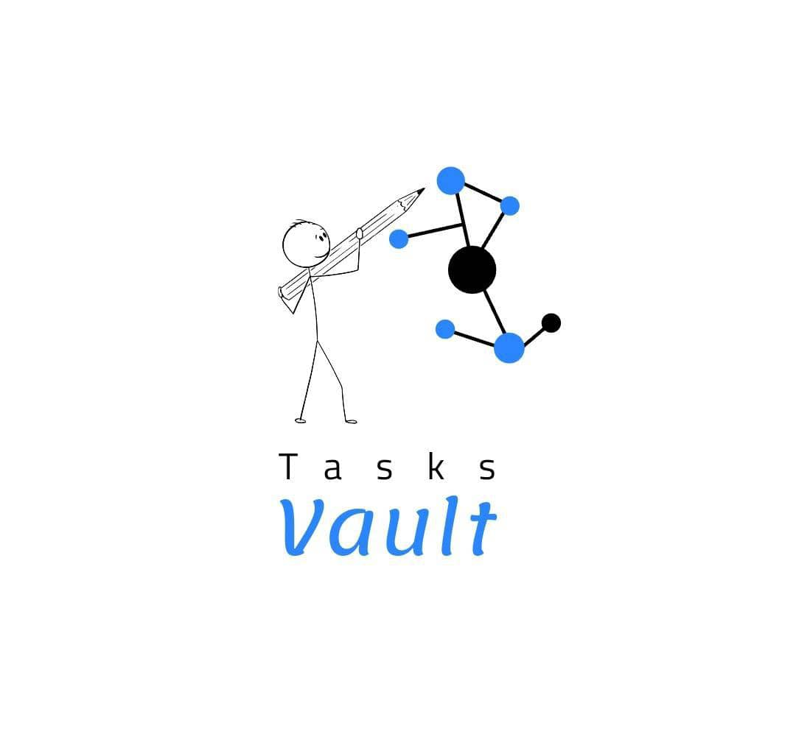
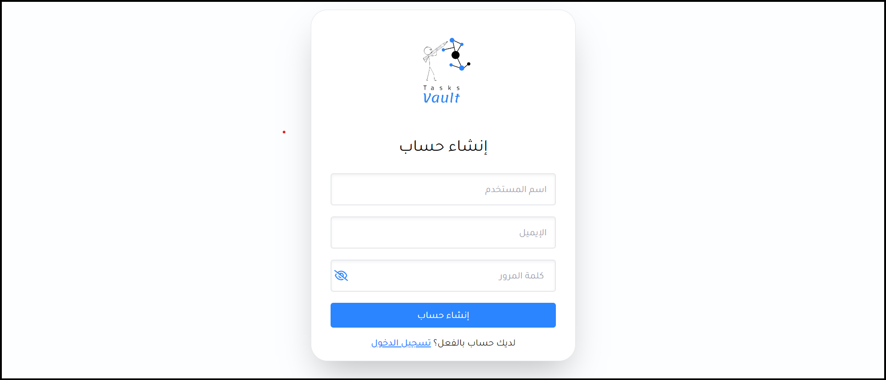
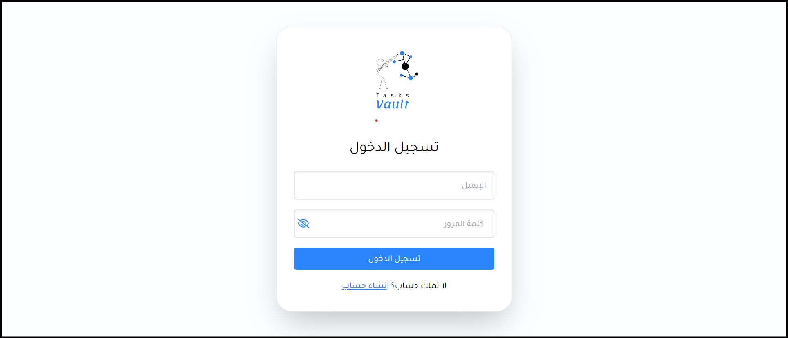
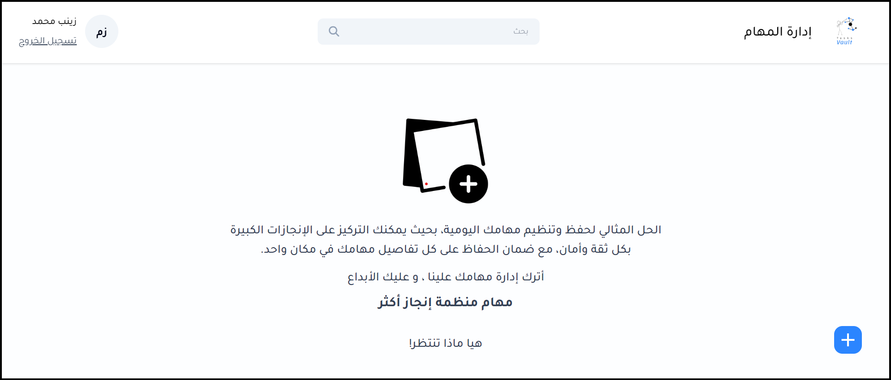
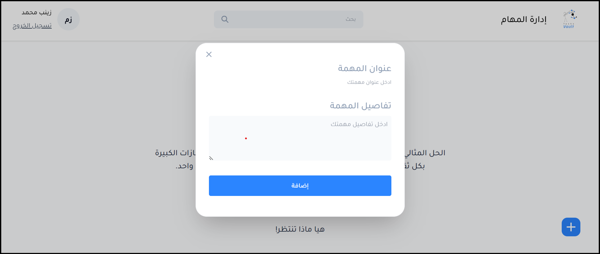
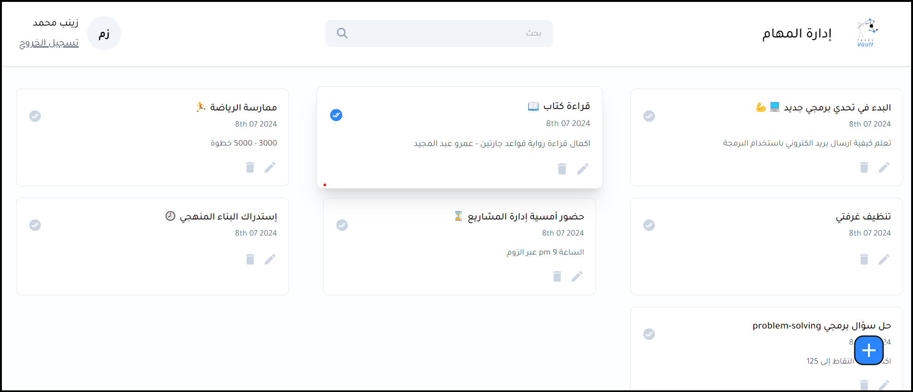
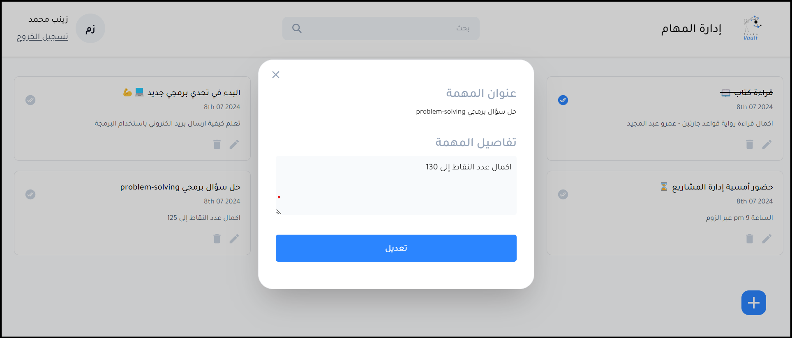
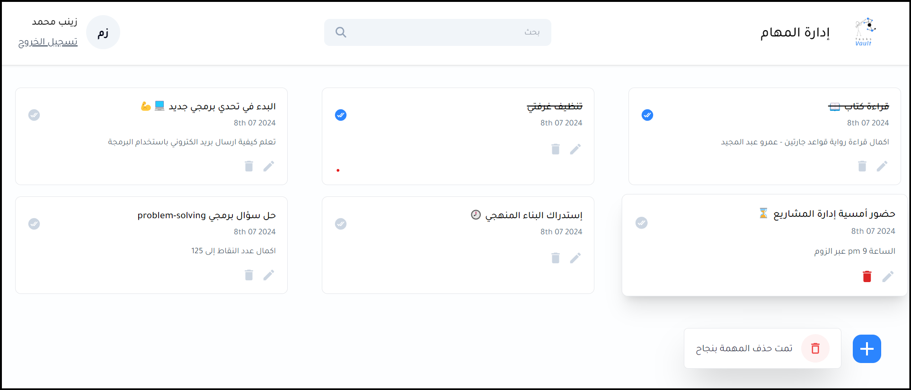
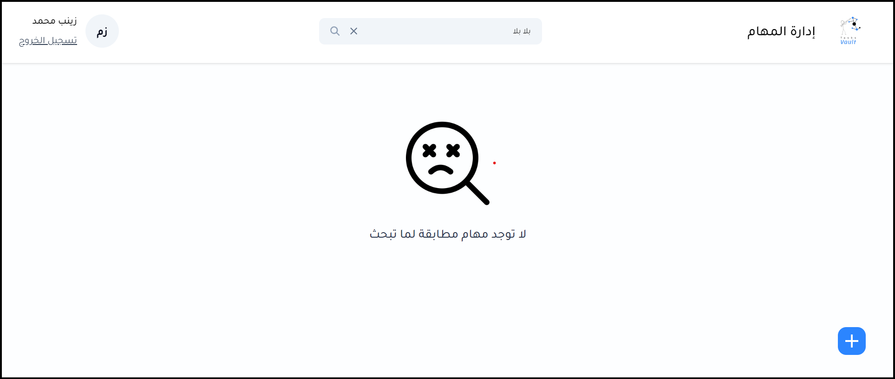

# Task Management Web Application



## Live Link
https://tasksvaultt.netlify.app/login


## Table of Contents

- [About the Project](#about-the-project)
- [Screenshots](#screenshots)
- [Technologies Used](#technologies-used)
- [Setup / Installation](#setup--installation)
- [Features](#features)
- [Contributing](#contributing)
- [Code of Conduct](#code-of-conduct)
- [Security Vulnerabilities](#security-vulnerabilities)
- [License](#license)

## About the Project

The Tasks Management Web Application is designed to streamline task management processes. Users can create, update, prioritize, and track tasks efficiently through an intuitive interface.

## Screenshots

### Signup To mange tasks



### Login



### Get  Start To Create Tasks



### Add Task



### Displa All Tasks



### Edit Task



### Delete Task



### Search Task



## Technologies Used

- **Frontend**: React.js, Tailwind CSS
- **Backend**: Node.js, Express.js, MongoDB
- **Authentication**: JSON Web Tokens (JWT)
- **Deployment**: Netlify

## Setup / Installation

To run this project locally, follow these steps:

1. **Clone the repository:**

   ```bash
   git clone https://github.com/yourusername/Web_Developer_Challenge_Zainab.git
   cd Web_Developer_Challenge_Zainab
   ```

2. **Install dependencies:**

   ```bash
   # Install backend dependencies
   cd backend
   npm install

   # Install frontend dependencies
   cd ../frontend/tasks_managment
   npm install
   ```

3. **Set up environment variables:**

   Create a `.env` file in the `backend` directory with the following variables:

   ```plaintext
   PORT=8000
   MONGODB_URI=your_mongodb_connection_string
   JWT_SECRET=your_jwt_secret
   ```

4. **Start the backend server:**

   ```bash
   # In the backend directory
   npm start
   ```

5. **Start the frontend development server:**

   ```bash
   # In the frontend/tasks_managment directory
   npm run dev
   ```

6. **Access the application:**

   Open your web browser and go to `http://localhost:8000` to view the application.

## Features

- **Task Management**: Create, update, and delete tasks.
- **Authentication**: Secure login and registration using JWT.
- **Responsive UI**: Designed to work seamlessly on desktop and mobile devices.

## Contributing

Thank Rukn development team for considering contributing to this project! 

## Security Vulnerabilities

If you discover a security vulnerability or any bug, please report it via email to zain.mohh@gmail.com. 
## License

This project is self-developement for learning
